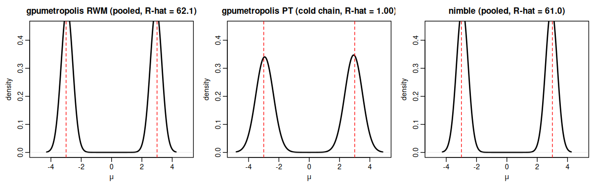
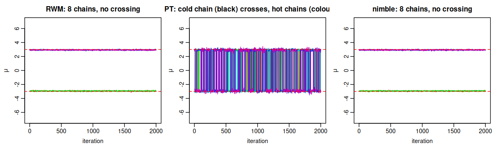

[](https://pcbrom.r-universe.dev/gpumetropolis)
[](https://lifecycle.r-lib.org/articles/stages.html#experimental)
[](https://opensource.org/licenses/MIT)

# gpumetropolis

<!-- badges: start -->
<!-- badges: end -->

A generic Metropolis-Hastings sampler for Markov chain Monte Carlo. The user
declares a model by writing its log-likelihood and log-prior as ordinary R
formulas; the package compiles them to a portable kernel that runs on the CPU
and the GPU from one source. The sampler advances many independent chains in
one batched pass. It occupies a niche that no general R repository fills: a
generic MCMC sampler with a vendor-agnostic GPU-portable kernel.

The model expression is compiled to a stack-machine bytecode that a single
CubeCL kernel interprets, so any model in the supported operation set runs on
the CPU and GPU with no runtime code generation. CubeCL compiles that one
kernel for the CUDA, Vulkan and CPU backends the package exposes.

The package is under active development. See `## Project status` below.

## Installation

The package is distributed through R-universe. It is not on CRAN: the vendored
Rust dependency tree, dominated by the CUDA and Vulkan stacks, exceeds the CRAN
tarball-size limit, so R-universe is its home.

Installing requires a Rust toolchain (`cargo`, `rustc >= 1.85`); see
<https://rustup.rs>.

``` r
install.packages("gpumetropolis",
                 repos = c("https://pcbrom.r-universe.dev",
                           "https://cloud.r-project.org"))
```

A source install detects the GPU toolchains present on the build host and
enables the matching backends without the user passing any flag. The CUDA
backend is added when `nvcc` is on `PATH`; the Vulkan backend, when
`vulkaninfo` is on `PATH`. Hosts with no GPU toolchain build CPU-only.

The pre-built binaries on R-universe are CPU-only because the build runners
have no GPU toolkits installed; to obtain a GPU-enabled binary, install from
source on a host that has the toolkit:

``` r
install.packages("gpumetropolis", type = "source",
                 repos = c("https://pcbrom.r-universe.dev",
                           "https://cloud.r-project.org"))
```

The auto-detection can be overridden with `GPUMETROPOLIS_BACKENDS` (`auto`,
`cpu`, `cuda`, `vulkan`, or a comma list) and the per-backend toggles
`GPUMETROPOLIS_CUDA` and `GPUMETROPOLIS_VULKAN` (`0` or `1`).

## Load package

``` r
library(gpumetropolis)
```

## Quick start

A model is declared by writing its per-observation log-likelihood as a
one-sided formula in the parameter and data names. The example below is the
Gaussian mean with known standard deviation 2 and a flat prior; its posterior
is available in closed form, which makes it a clean check that the sampler
recovers known parameters.

``` r
set.seed(1)
y <- rnorm(20000, mean = 3.4, sd = 2)

model <- gpum_model(
  loglik = ~ -((y - mu)^2) / 8,   # sigma = 2, so 0.5 / sigma^2 = 1 / 8
  params = "mu",
  data = "y"
)

fit <- gpu_metropolis(model, data = list(y = y),
                      n_iter = 3000, n_chains = 8)
fit

# the same declaration runs on a specific backend; the default
# `backend = "auto"` picks CUDA when its feature is compiled in, then
# Vulkan, and falls back to the CPU.
fit_gpu <- gpu_metropolis(model, data = list(y = y),
                          n_iter = 3000, n_chains = 8, backend = "cuda")

# parallel tempering for multimodal targets, since v0.3.0
fit_pt <- gpu_metropolis(model, data = list(y = y),
                         n_iter = 3000, n_chains = 8, method = "pt")
```

Since v0.2.0 the warmup is adaptive by default and is discarded before
`fit$draws` is returned; `proposal_sd` is only the warmup seed and the
per-chain proposal scale adapts to its own geometry, so most users no
longer need to tune it. Set `adapt = FALSE` to recover the trim-only
warmup of 0.1.x.

The supported operations in a formula are `+`, `-`, `*`, `/`, `^`, unary `-`,
and `exp`, `log`, `sqrt`. A symbol that is not a declared parameter or data
column, or a function outside this set, is rejected at compile time with a
clear error.

## Convergence diagnostics

Since v0.2.0 the one-call entry point is `gpum_diagnose(fit)`: it prints a
per-parameter table (mean, standard deviation, the 2.5%, 50% and 97.5%
quantiles, split R-hat, effective sample size and Monte Carlo standard
error) with a convergence verdict from the canonical thresholds, and opens
a multi-panel diagnostic plot per parameter; when the warmup was adaptive
an extra row shows the per-chain acceptance over the warmup batches with
the asymptotic optimum as a reference, and on a parallel-tempering fit a
further row shows the swap acceptance per pair.

``` r
gpum_diagnose(fit)
```

The individual building blocks are also exported. Equivalence for MCMC is
distributional, never bit-exact, because the algorithm is stochastic.

``` r
draws <- fit$draws[, , "mu"]   # iterations by chains
rhat(draws, warmup = 0)        # split potential scale reduction factor
ess(draws, warmup = 0)         # effective sample size, Geyer estimator

# distributional equivalence between the CPU and GPU runs
ks_equivalence(fit$draws[, , "mu"], fit_gpu$draws[, , "mu"])
```

`ks_equivalence` thins the pooled draws down to the effective sample size
before the Kolmogorov-Smirnov test, because that test assumes independent
draws while MCMC output is autocorrelated.

Since v0.4.0, `gpum_crlb(fit, data)` adds an optional Cramer-Rao reference: it
forms the observed Fisher information by a finite-difference Hessian of the
compiled log-likelihood and inverts it to the lower bound on the covariance of
an unbiased estimator, reporting it beside the empirical posterior spread. The
bound is a frequentist asymptotic, prior-free reference; under the regularity
of the Bernstein-von Mises theorem the posterior covariance approaches it, so
an agreement is a check that the sampler recovered the information-bound
geometry. The function withholds the comparison, with a stated reason, when a
model has no data term, when the largest R-hat signals a multimodal or
unconverged posterior, or when the observed information is not positive
definite.

Also since v0.4.0, a formal Bayesian decision and comparison layer reads off
the fit. From the draws alone, `gpum_hypothesis(fit, parameter, lower, upper)`
gives the posterior probability of an interval or one-sided hypothesis, and
`gpum_rope(fit, parameter, rope)` applies the region-of-practical-equivalence
rule against the highest density interval. For predictive model comparison
without a marginal likelihood, `gpum_waic(fit, data)` and `gpum_loo(fit, data)`
report WAIC and Pareto-smoothed importance-sampling leave-one-out, the latter
through the `loo` package. For the weight of evidence,
`gpum_evidence(model, data)` estimates the log marginal likelihood by
thermodynamic integration from the prior to the posterior, and
`gpum_bayes_factor(model1, model0, data)` forms the Bayes factor; both require
a proper prior and report the prior-sensitivity caveat. The posterior
predictive check is deferred to the release that adds data generation.

## When the GPU helps, and when it does not

A GPU does not accelerate every MCMC. The sequential dependence inside a chain
cannot be parallelised. The parallelism comes from two axes: many independent
chains, and the data-parallel evaluation of the log-density. A GPU pays off
when the log-density is expensive to evaluate, that is over a large data set,
or when thousands of chains are run. For a small model with few chains the
CPU-GPU transfer overhead dominates and the GPU is slower than the CPU. The
package documentation states this regime plainly rather than promising
unconditional speedups.

## Project status

The development follows a phased plan.

- Phase 0, complete: CPU reference sampler in Rust, batched over chains, plus
  the distributional equivalence harness.
- Phase 1, complete: the generic model DSL, the CubeCL bytecode interpreter
  kernel, and the `gpum_model()` / `gpu_metropolis()` API. A model declared by
  formula runs on the CPU, CUDA and Vulkan backends from one source.
- Phase 2, complete: the block-per-chain kernel with a shared-memory data
  reduction, and the native CPU backend.
- Phase 3, factorial complete: the registered factorial over models M1 to M4
  across the eight backends, summarised in the Benchmark section below.
- Phase 4 (v0.2.0): backend selection defaults to `"auto"`, the warmup
  adapts per chain through Welford and Robbins-Monro, and `gpum_diagnose()`
  becomes the one-call diagnostic. `proposal_sd` is no longer a tuning
  parameter; it is only the warmup seed.
- Phase 5 (v0.3.0): parallel tempering, `method = "pt"`. Each chain runs at
  its own temperature on the same target; between batches a swap step
  shuttles states between the cold chain and the hot ones. The focused
  re-run of model M2 is recorded as amendment v0.9 of
  [`EXPERIMENT_PROTOCOL.md`](https://github.com/pcbrom/gpumetropolis/blob/main/EXPERIMENT_PROTOCOL.md)
  and as the vignette
  [`m2_parallel_tempering`](https://github.com/pcbrom/gpumetropolis/blob/main/vignettes/m2_parallel_tempering.Rmd).
- Phase 6 (v0.4.0): Differential Evolution MCMC, `method = "de"`. The
  proposal for each chain is the scaled difference of two other chains, so it
  aligns with the correlation of the target through the ensemble geometry,
  with no explicit covariance and no hand tuning of the proposal scale (ter
  Braak 2006). Two worked cases enter the living book: the twisted Gaussian
  of Haario, Saksman and Tamminen (2001) in
  [`demc_banana`](https://github.com/pcbrom/gpumetropolis/blob/main/vignettes/demc_banana.Rmd),
  and a strongly correlated bivariate posterior with a closed-form
  Cramer-Rao reference in
  [`demc_correlated`](https://github.com/pcbrom/gpumetropolis/blob/main/vignettes/demc_correlated.Rmd).
  The amendment v1.0 of
  [`EXPERIMENT_PROTOCOL.md`](https://github.com/pcbrom/gpumetropolis/blob/main/EXPERIMENT_PROTOCOL.md)
  records the protocol for these cases.

The package is released through R-universe; see Installation above.

## Roadmap

The direction beyond the current release is recorded, tiered, in
[`ROADMAP.md`](https://github.com/pcbrom/gpumetropolis/blob/main/ROADMAP.md).
The in-scope Metropolis-Hastings family is now complete through Differential
Evolution MCMC (v0.4.0), the plotting layer of v0.4.1 and the per-generation
DE variant of v0.4.2 under `de_sync = TRUE`. The extreme-optimisation
milestone (v0.5.0) is delivered: the adaptive warmup gained full-covariance
proposals from a cross-chain pooled covariance, dimension-dependent
acceptance targets and a mid-warmup restart, and the `rwm` path now wins the
live head-to-heads of the case-study vignettes against Stan and the generic
samplers, median of three runs on the versioned harness (amendment v1.1 of
`EXPERIMENT_PROTOCOL.md`). The two regimes that verdict conceded are closed
by 0.5.1 and 0.5.2: `gpum_lm()` samples conjugate Gaussian linear models
exactly from the closed-form posterior (6 to 7 million effective draws per
second, above the Gibbs specialists on their own ground), and
`method = "mala"` adds Metropolis-adjusted Langevin with reverse-mode
automatic differentiation of the model bytecode, JIT-compiled beside the
density, winning threefold against Stan on a d = 21 logistic regression
(amendment v1.2). The application trajectory follows with the
bivariate copula
workflow (v0.6.0), per-column marginal auto-selection (v0.7.0), vine copula
for higher dimension (v0.8.0) and synthesis
(v0.9.0). The distribution catalogue that drives the marginal auto-selection
is specified in
[`CATALOG_DESIGN.md`](https://github.com/pcbrom/gpumetropolis/blob/main/CATALOG_DESIGN.md).
The long arc is a portable probabilistic computing runtime built around
MCMC-driven copula synthesis; the current package is its foundation.

## Benchmark

The package carries a pre-registered experiment that characterises, in a
refutable way, the regime in which `gpumetropolis` beats, ties or loses to the
established R MCMC packages (`MCMCpack`, `mcmc`, `nimble`, `BayesianTools`,
Stan via `cmdstanr`). The design, the six hypotheses with their support and
refutation conditions, and the decision rules are frozen in
[`EXPERIMENT_PROTOCOL.md`](https://github.com/pcbrom/gpumetropolis/blob/main/EXPERIMENT_PROTOCOL.md),
committed before any result existed. The primary metric is effective sample
size per second, computed uniformly with `coda` so the estimator is not a
confounder.

The figure below is from the full M1 run (protocol amendments v0.5 and v0.6:
model M1, the Gaussian mean; fifteen replications per cell over the registered
grid of data sizes N and chain counts C; 1129 completed runs). The harder
models M2 to M4 follow in their own subsection below.


The result, stated plainly:

- Correctness first. Seven of the eight backends pass the H1 gate, the
  Holm-Bonferroni family-wise correction over the Kolmogorov-Smirnov tests,
  with no surviving rejection; the Vulkan backend carries one. The protocol's
  v0.2 secondary diagnostic resolves this: the per-backend KS rejection rate at
  nominal `alpha = 0.05` ranges from 4.1 to 10.3 percent across all eight
  backends, with `MCMCpack`, a mature reference package, the highest at 10.3
  percent and Vulkan below it at 9.5 percent. The KS gate is anti-conservative
  on the autocorrelated draws MCMC produces, gate-wide and not specific to one
  backend; the single Holm survivor reflects that property, not a Vulkan
  defect. The investigation reported under M3 below later identified a second
  harness property, a within-cell correlation from consecutive seeds, that
  likewise inflated the variance of the `gpumetropolis` rejection estimates in
  this run; both are properties of the harness, and a long-chain convergence
  test confirms the sampler itself is correct. R-hat has median 1.0016 and
  maximum 1.0199 across every completed run.
- With **one chain**, `gpumetropolis` does not beat the mature CPU packages.
  At N = 1e3 its CUDA backend reaches 0.99 times the effective sample size per
  second of the best competitor, parity; at N = 1e5 it reaches 0.07 times. A
  GPU does not help a single chain; this is the regime the caveats name.
- With **many chains**, the picture inverts. At 64 chains and N = 1e3 the CUDA
  backend is 54 times the best competitor. At 4096 chains it is the only
  backend that completes the cell at all: the competitors do not run thousands
  of chains within the time budget.

So the honest reading: `gpumetropolis` earns its place in the many-chains
regime and on the portability of one kernel source across CPU, CUDA and
Vulkan, not as a faster single-chain sampler. The per-cell numbers are in
[`benchmark/full_m1_cell_summary.csv`](https://github.com/pcbrom/gpumetropolis/blob/main/benchmark/full_m1_cell_summary.csv).

### Beyond the Gaussian mean: models M2 to M4

The registered factorial continues with three harder targets: M2 a separated
bimodal posterior, M3 a heavy-tailed Student-t location model, M4 an
ill-conditioned three-dimensional Gaussian. The run completed 2568
replications across the three models; its design and the departures from the
registered factorial are recorded in protocol amendment v0.7.


The honest reading, model by model:

- **M3, the heavy-tailed model**, is the clearest win. The compiled kernel
  evaluates the Student-t log-density cheaply where the competitors pay an
  R-callback per iteration. The CUDA backend reaches 3.0 times the effective
  sample size per second of the best competitor with a single chain, 225 times
  at 64 chains, and is the only backend to complete the 4096-chain cell.
  Correctness: the M3 run first showed the `gpumetropolis` backends with a KS
  rejection rate near 13 percent against about 7 percent for the fixed-scale
  random-walk competitor `mcmc`. The investigation settled it. A single chain
  of two million iterations matches the exact posterior at every proposal
  scale, so the sampler's stationary distribution is correct. The apparent
  elevation was a benchmark-harness artifact: the seed scheme assigns
  consecutive seeds to the replications of a cell, and the counter-based RNG
  mixed the seed additively with the counter, so consecutive seeds gave
  overlapping streams that correlated `gpumetropolis`'s within-cell
  replications and inflated the variance of its rejection-rate estimate. The
  competitors, seeded through R's Mersenne-Twister, were unaffected. The
  package now hashes the seed, so consecutive seeds give independent streams;
  the fix does not change the speed or the per-run correctness reported here.
- **M2, the bimodal model**, is the regime where many chains matter most: a
  single random-walk chain cannot cross between separated modes. The KS pass
  rate against the exact bimodal reference is 0 percent with one chain, 84
  percent with eight, and falls back to 55 percent at 4096 chains as the test
  gains power to detect the residual mode-weight sampling error any finite set
  of chains carries. Every backend is flagged by the family-wise gate for that
  reason; among the eight, the `gpumetropolis` CUDA and Vulkan backends have
  the lowest rejection rate, and `BayesianTools` fails the model outright. In
  speed, CUDA reaches 78 times the best competitor at 64 chains and is again
  the sole backend completing the 4096-chain cell.

  The parallel-tempering path of v0.3.0 changes this picture. See the
  next subsection.
- **M4, the ill-conditioned Gaussian**, is the model where `gpumetropolis`
  loses, and the loss is stated plainly. H1 is supported for all eight
  backends. But `nimble` detects that the target is exactly Gaussian and
  assigns a conjugate sampler that draws independent samples directly,
  reaching on the order of three thousand times the effective sample size per
  second of the `gpumetropolis` random walk. A generic random-walk Metropolis
  does not, and does not claim to, compete with a specialised algorithm on a
  target that algorithm is built for. M4 also sharpens the GPU caveat: with no
  observed data and one chain the CUDA backend is slower than the native CPU
  backend, since there is no data-parallel work to amortise the kernel launch.
  R-hat has median 1.10 across M4, the expected signature of slow random-walk
  mixing on a condition-98 geometry, uniform across backends.

### Parallel tempering and the M2 mode-crossing trap

The M2 paragraph above reports that the registered factorial gives every
backend a high KS rejection rate on the bimodal target. The diagnostic in
that report is the family-wise KS gate, which compares the pooled draws
against the closed-form bimodal reference. The trap of that diagnostic is
that pooling eight chains, each stuck in one of the two basins, produces a
sample that already resembles the reference: half of the chains contribute
the positive mode, half contribute the negative mode, and the pooled
empirical CDF tracks the symmetric bimodal target closely. The pretty
bimodal shape of the pooled draws is then the artefact of overlay, not the
signature of correct mixing.

The honest diagnostic for M2 is the split R-hat, which compares the
within-chain variance and the between-chain variance. Stuck chains have a
within-chain variance set by the spread inside one mode and a
between-chain variance set by the spread between the two modes, and the
ratio is large: R-hat reports the mismatch as a value far above one.

The focused single-cell re-run of 2026-06-15 measures this directly. The
cell is `N = 400` observations, `C = 8` chains, 4000 iterations per chain
with 2000 discarded as warmup, twenty replications, comparing three
adapters: `gpumetropolis-cpu` for the random-walk Metropolis baseline,
`gpumetropolis-cpu-pt` for the `method = "pt"` path of v0.3.0, and
`nimble` as the strongest M2 competitor of v0.7.

| adapter | R-hat | ESS | ESS/s | wall-clock (s) |
|---|---|---|---|---|
| gpumetropolis-cpu (RWM) | 62.28 | 3525 | 27782 | 0.13 |
| gpumetropolis-cpu-pt | **1.00** | 671 | 3007 | 0.23 |
| nimble | 61.97 | 3652 | 26973 | 0.15 |

Two figures make the verdict visible.



The three pooled densities look almost identical: two peaks at the
reference modes (dashed red). The verdict is in the title of each panel.
R-hat near 1.00 for parallel tempering says the cold chain visits both
modes within a single run; R-hat near 62 for the random-walk panels says
each chain stayed in its starting basin, and the bimodal shape of the
pooled draws is the artefact of overlaying eight stuck chains.



The traces tell the same story directly. The eight chains of the
random-walk runs and of `nimble` form flat lines at +3 and -3, with no
visible crossing across the 2000 post-warmup iterations. The cold chain
of the parallel-tempering run, drawn in black in the centre panel and
the lowest-temperature chain by construction, jumps repeatedly between
basins, fed by the hot chains, drawn in colour, which mix freely on
their tempered targets.

The cost of the correct answer is a 1.7x wall-clock factor over random
walk for the host-side swap step and a lower nominal effective sample
size, since each cold-chain draw now pays the autocorrelation of a true
mode-crossing chain rather than the autocorrelation of a stuck one. The
full numbers and the harness are in
[`benchmark/m2_pt_summary.csv`](https://github.com/pcbrom/gpumetropolis/blob/main/benchmark/m2_pt_summary.csv);
the focused re-run is amendment v0.9 of
[`EXPERIMENT_PROTOCOL.md`](https://github.com/pcbrom/gpumetropolis/blob/main/EXPERIMENT_PROTOCOL.md);
the corresponding worked-case vignette is
[`vignettes/m2_parallel_tempering.Rmd`](https://github.com/pcbrom/gpumetropolis/blob/main/vignettes/m2_parallel_tempering.Rmd),
the first chapter of the package's living book of cases.

### Where this package fits in the MCMC ecosystem

The results above are textbook successes of parallel tempering, not
algorithmic novelty: PT (Geyer 1991; Earl-Deem 2005) is the classical
remedy for multimodal targets and any correct implementation recovers
R-hat near 1 on the M2 cell. The value `gpumetropolis` adds is product
design and portability, not a new sampling algorithm. The honest
positioning against the wider MCMC ecosystem follows.

**Where the established tools dominate**: for **differentiable
unimodal targets in `d` greater than five (GLMs, hierarchical models,
regression)** the gradient-based samplers of `Stan`, `PyMC` and
`NumPyro` are dramatically more efficient than any random-walk
Metropolis; ESS-per-second improvements of one to three orders of
magnitude are routine. For **fast approximate inference** the
variational paths through `Stan` (ADVI), `PyMC` (BBVI) or `INLA` (Rue
et al. 2009) cost a small fraction of the MCMC wall-clock. For
**mixture models with unknown number of components** reversible-jump
MCMC (Richardson and Green 1997) or Dirichlet-process mixtures estimate
the parameters and `k` jointly, which fixed-`k` tempering does not. For
**likelihoods that are intractable** ABC and pseudo-marginal methods
(Andrieu and Roberts 2009) are the right tool. The package does not
compete on those axes and does not claim to.

**Where `gpumetropolis` adds value**: the package is the right pick
when the workflow needs:

| Need | Why this package |
|---|---|
| **One kernel source across CPU, CUDA and Vulkan** | the CubeCL kernel and the Rust glue produce a single declaration that runs on all three; `Stan` requires CmdStanGPU for partial GPU coverage on OpenCL, `PyMC` requires the JAX backend dominated by NVIDIA, no other package matches the vendor-agnostic guarantee |
| **Hundreds to thousands of parallel chains** | the registered factorial completes the 4096-chain cell that the other backends do not, and the many-chains axis is the natural GPU parallelism axis exploited by the block-per-chain kernel |
| **Parallel tempering in one line** | `method = "pt"` is a built-in path; `Stan` and `PyMC` users typically hand-code the swap step or reach for external wrappers |
| **A formula-based DSL for the log-likelihood** | the same R formula a user would already write becomes the kernel; no Stan or BUGS to translate to |

**Honest verdict on the worked cases of the living book**: the M2 PT
fit and the Gumbel-mixture fit shown in the two vignettes are
**competitive, not state-of-the-art**. A custom Stan script with hand-
coded tempering reaches comparable accuracy in comparable wall-clock
on both cases. The advantage of `gpumetropolis` is workflow (one
formula plus `method = "pt"` against custom Stan code) and portability
(the same kernel runs on whatever GPU is on the host), not algorithmic
superiority.

The longer arc of the package, the application path of v0.6.0 through
v0.9.0 (bivariate copula, marginal auto-selection, vine copula,
synthesis), is where the design is intended to deliver something that
no current single R package puts together end to end: dataset in,
ranked Bayesian fits out, synthetic dataset out. The MCMC engine is
the foundation, not the headline.

The complete picture: `gpumetropolis` is fast in the regime it claims, many
chains and an expensive log-density, and M3 shows it can win even with a
single chain. It is not a faster sampler than a specialised algorithm where
that algorithm applies, as M4 makes explicit. The per-cell numbers are in
[`benchmark/full_m234_cell_summary.csv`](https://github.com/pcbrom/gpumetropolis/blob/main/benchmark/full_m234_cell_summary.csv).

The machine and software environment of the benchmark host is recorded in
[`benchmark/ENVIRONMENT.md`](https://github.com/pcbrom/gpumetropolis/blob/main/benchmark/ENVIRONMENT.md),
regenerated by `benchmark/capture_env.sh`, so the run can be reproduced or
audited.

## Issues

Please report issues at <https://github.com/pcbrom/gpumetropolis/issues>.

## Citation

``` r
citation("gpumetropolis")
```
