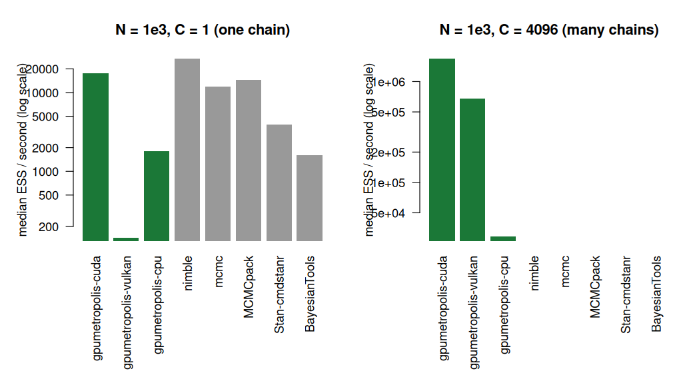
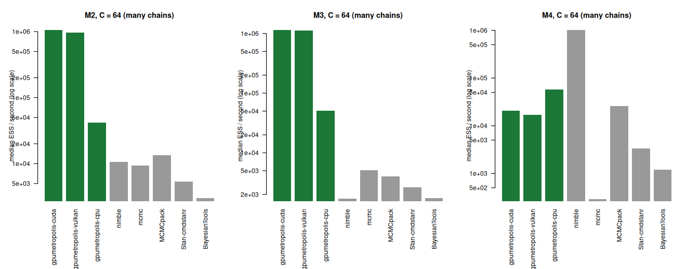

[](https://pcbrom.r-universe.dev/gpumetropolis)
[](https://lifecycle.r-lib.org/articles/stages.html#experimental)
[](https://opensource.org/licenses/MIT)

# gpumetropolis

<!-- badges: start -->
<!-- badges: end -->

A generic Metropolis-Hastings sampler for Markov chain Monte Carlo. The user
declares a model by writing its log-likelihood and log-prior as ordinary R
formulas; the package compiles them to a portable kernel that runs on the CPU
and the GPU from one source. The sampler advances many independent chains in
one batched pass. It occupies a niche that no general R repository fills: a
generic MCMC sampler with a vendor-agnostic GPU-portable kernel.

The model expression is compiled to a stack-machine bytecode that a single
CubeCL kernel interprets, so any model in the supported operation set runs on
the CPU and GPU with no runtime code generation. CubeCL compiles that one
kernel for CUDA, ROCm, Vulkan and CPU back ends.

The package is under active development. See `## Project status` below.

## Installation

The package is distributed through R-universe. It is not on CRAN: the vendored
Rust dependency tree, dominated by the CUDA and Vulkan stacks, exceeds the CRAN
tarball-size limit, so R-universe is its home.

Installing requires a Rust toolchain (`cargo`, `rustc >= 1.85`); see
<https://rustup.rs>.

``` r
install.packages("gpumetropolis",
                 repos = c("https://pcbrom.r-universe.dev",
                           "https://cloud.r-project.org"))
```

A source install detects the GPU toolchains present on the build host and
enables the matching backends without the user passing any flag. The CUDA
backend is added when `nvcc` is on `PATH`; the Vulkan backend, when
`vulkaninfo` is on `PATH`. Hosts with no GPU toolchain build CPU-only.

The pre-built binaries on R-universe are CPU-only because the build runners
have no GPU toolkits installed; to obtain a GPU-enabled binary, install from
source on a host that has the toolkit:

``` r
install.packages("gpumetropolis", type = "source",
                 repos = c("https://pcbrom.r-universe.dev",
                           "https://cloud.r-project.org"))
```

The auto-detection can be overridden with `GPUMETROPOLIS_BACKENDS` (`auto`,
`cpu`, `cuda`, `vulkan`, or a comma list) and the per-backend toggles
`GPUMETROPOLIS_CUDA` and `GPUMETROPOLIS_VULKAN` (`0` or `1`).

## Load package

``` r
library(gpumetropolis)
```

## Quick start

A model is declared by writing its per-observation log-likelihood as a
one-sided formula in the parameter and data names. The example below is the
Gaussian mean with known standard deviation 2 and a flat prior; its posterior
is available in closed form, which makes it a clean check that the sampler
recovers known parameters.

``` r
set.seed(1)
y <- rnorm(20000, mean = 3.4, sd = 2)

model <- gpum_model(
  loglik = ~ -((y - mu)^2) / 8,   # sigma = 2, so 0.5 / sigma^2 = 1 / 8
  params = "mu",
  data = "y"
)

fit <- gpu_metropolis(model, data = list(y = y), proposal_sd = 0.05,
                      n_iter = 3000, n_chains = 8, backend = "cpu")
fit

# the same declaration runs on the GPU
fit_gpu <- gpu_metropolis(model, data = list(y = y), proposal_sd = 0.05,
                          n_iter = 3000, n_chains = 8, backend = "cuda")
```

The supported operations in a formula are `+`, `-`, `*`, `/`, `^`, unary `-`,
and `exp`, `log`, `sqrt`. A symbol that is not a declared parameter or data
column, or a function outside this set, is rejected at compile time with a
clear error.

## Convergence diagnostics

The package ships a distributional equivalence harness. Equivalence for MCMC is
distributional, never bit-exact, because the algorithm is stochastic.

``` r
draws <- fit$draws[, , "mu"]   # iterations by chains
rhat(draws)                    # split potential scale reduction factor
ess(draws)                     # effective sample size, Geyer estimator

# distributional equivalence between the CPU and GPU runs
ks_equivalence(fit$draws[, , "mu"], fit_gpu$draws[, , "mu"])
```

`ks_equivalence` thins the pooled draws down to the effective sample size
before the Kolmogorov-Smirnov test, because that test assumes independent
draws while MCMC output is autocorrelated.

## When the GPU helps, and when it does not

A GPU does not accelerate every MCMC. The sequential dependence inside a chain
cannot be parallelised. The parallelism comes from two axes: many independent
chains, and the data-parallel evaluation of the log-density. A GPU pays off
when the log-density is expensive to evaluate, that is over a large data set,
or when thousands of chains are run. For a small model with few chains the
CPU-GPU transfer overhead dominates and the GPU is slower than the CPU. The
package documentation states this regime plainly rather than promising
unconditional speedups.

## Project status

The development follows a phased plan.

- Phase 0, complete: CPU reference sampler in Rust, batched over chains, plus
  the distributional equivalence harness.
- Phase 1, complete: the generic model DSL, the CubeCL bytecode interpreter
  kernel, and the `gpum_model()` / `gpu_metropolis()` API. A model declared by
  formula runs on the CPU, CUDA and Vulkan backends from one source.
- Phase 2, complete: the block-per-chain kernel with a shared-memory data
  reduction, and the native CPU backend.
- Phase 3, factorial complete: the registered factorial over models M1 to M4
  across the eight backends, summarised in the Benchmark section below. The
  package is released through R-universe; see Installation above.

## Roadmap

The direction beyond the first release is recorded, tiered, in
[`ROADMAP.md`](https://github.com/pcbrom/gpumetropolis/blob/main/ROADMAP.md):
the in-scope Metropolis-Hastings-family next steps (adaptive Metropolis,
differential evolution MCMC, parallel tempering), the optimisation layers, and
the larger directions. The long arc is a portable probabilistic computing
runtime; the current package is its foundation.

## Benchmark

The package carries a pre-registered experiment that characterises, in a
refutable way, the regime in which `gpumetropolis` beats, ties or loses to the
established R MCMC packages (`MCMCpack`, `mcmc`, `nimble`, `BayesianTools`,
Stan via `cmdstanr`). The design, the six hypotheses with their support and
refutation conditions, and the decision rules are frozen in
[`EXPERIMENT_PROTOCOL.md`](https://github.com/pcbrom/gpumetropolis/blob/main/EXPERIMENT_PROTOCOL.md),
committed before any result existed. The primary metric is effective sample
size per second, computed uniformly with `coda` so the estimator is not a
confounder.

The figure below is from the full M1 run (protocol amendments v0.5 and v0.6:
model M1, the Gaussian mean; fifteen replications per cell over the registered
grid of data sizes N and chain counts C; 1129 completed runs). The harder
models M2 to M4 follow in their own subsection below.



The result, stated plainly:

- Correctness first. Seven of the eight backends pass the H1 gate, the
  Holm-Bonferroni family-wise correction over the Kolmogorov-Smirnov tests,
  with no surviving rejection; the Vulkan backend carries one. The protocol's
  v0.2 secondary diagnostic resolves this: the per-backend KS rejection rate at
  nominal `alpha = 0.05` ranges from 4.1 to 10.3 percent across all eight
  backends, with `MCMCpack`, a mature reference package, the highest at 10.3
  percent and Vulkan below it at 9.5 percent. The KS gate is anti-conservative
  on the autocorrelated draws MCMC produces, gate-wide and not specific to one
  backend; the single Holm survivor reflects that property, not a Vulkan
  defect. The investigation reported under M3 below later identified a second
  harness property, a within-cell correlation from consecutive seeds, that
  likewise inflated the variance of the `gpumetropolis` rejection estimates in
  this run; both are properties of the harness, and a long-chain convergence
  test confirms the sampler itself is correct. R-hat has median 1.0016 and
  maximum 1.0199 across every completed run.
- With **one chain**, `gpumetropolis` does not beat the mature CPU packages.
  At N = 1e3 its CUDA backend reaches 0.99 times the effective sample size per
  second of the best competitor, parity; at N = 1e5 it reaches 0.07 times. A
  GPU does not help a single chain; this is the regime the caveats name.
- With **many chains**, the picture inverts. At 64 chains and N = 1e3 the CUDA
  backend is 54 times the best competitor. At 4096 chains it is the only
  backend that completes the cell at all: the competitors do not run thousands
  of chains within the time budget.

So the honest reading: `gpumetropolis` earns its place in the many-chains
regime and on the portability of one kernel source across CPU, CUDA and
Vulkan, not as a faster single-chain sampler. The per-cell numbers are in
[`benchmark/full_m1_cell_summary.csv`](https://github.com/pcbrom/gpumetropolis/blob/main/benchmark/full_m1_cell_summary.csv).

### Beyond the Gaussian mean: models M2 to M4

The registered factorial continues with three harder targets: M2 a separated
bimodal posterior, M3 a heavy-tailed Student-t location model, M4 an
ill-conditioned three-dimensional Gaussian. The run completed 2568
replications across the three models; its design and the departures from the
registered factorial are recorded in protocol amendment v0.7.



The honest reading, model by model:

- **M3, the heavy-tailed model**, is the clearest win. The compiled kernel
  evaluates the Student-t log-density cheaply where the competitors pay an
  R-callback per iteration. The CUDA backend reaches 3.0 times the effective
  sample size per second of the best competitor with a single chain, 225 times
  at 64 chains, and is the only backend to complete the 4096-chain cell.
  Correctness: the M3 run first showed the `gpumetropolis` backends with a KS
  rejection rate near 13 percent against about 7 percent for the fixed-scale
  random-walk competitor `mcmc`. The investigation settled it. A single chain
  of two million iterations matches the exact posterior at every proposal
  scale, so the sampler's stationary distribution is correct. The apparent
  elevation was a benchmark-harness artifact: the seed scheme assigns
  consecutive seeds to the replications of a cell, and the counter-based RNG
  mixed the seed additively with the counter, so consecutive seeds gave
  overlapping streams that correlated `gpumetropolis`'s within-cell
  replications and inflated the variance of its rejection-rate estimate. The
  competitors, seeded through R's Mersenne-Twister, were unaffected. The
  package now hashes the seed, so consecutive seeds give independent streams;
  the fix does not change the speed or the per-run correctness reported here.
- **M2, the bimodal model**, is the regime where many chains matter most: a
  single random-walk chain cannot cross between separated modes. The KS pass
  rate against the exact bimodal reference is 0 percent with one chain, 84
  percent with eight, and falls back to 55 percent at 4096 chains as the test
  gains power to detect the residual mode-weight sampling error any finite set
  of chains carries. Every backend is flagged by the family-wise gate for that
  reason; among the eight, the `gpumetropolis` CUDA and Vulkan backends have
  the lowest rejection rate, and `BayesianTools` fails the model outright. In
  speed, CUDA reaches 78 times the best competitor at 64 chains and is again
  the sole backend completing the 4096-chain cell.
- **M4, the ill-conditioned Gaussian**, is the model where `gpumetropolis`
  loses, and the loss is stated plainly. H1 is supported for all eight
  backends. But `nimble` detects that the target is exactly Gaussian and
  assigns a conjugate sampler that draws independent samples directly,
  reaching on the order of three thousand times the effective sample size per
  second of the `gpumetropolis` random walk. A generic random-walk Metropolis
  does not, and does not claim to, compete with a specialised algorithm on a
  target that algorithm is built for. M4 also sharpens the GPU caveat: with no
  observed data and one chain the CUDA backend is slower than the native CPU
  backend, since there is no data-parallel work to amortise the kernel launch.
  R-hat has median 1.10 across M4, the expected signature of slow random-walk
  mixing on a condition-98 geometry, uniform across backends.

The complete picture: `gpumetropolis` is fast in the regime it claims, many
chains and an expensive log-density, and M3 shows it can win even with a
single chain. It is not a faster sampler than a specialised algorithm where
that algorithm applies, as M4 makes explicit. The per-cell numbers are in
[`benchmark/full_m234_cell_summary.csv`](https://github.com/pcbrom/gpumetropolis/blob/main/benchmark/full_m234_cell_summary.csv).

The machine and software environment of the benchmark host is recorded in
[`benchmark/ENVIRONMENT.md`](https://github.com/pcbrom/gpumetropolis/blob/main/benchmark/ENVIRONMENT.md),
regenerated by `benchmark/capture_env.sh`, so the run can be reproduced or
audited.

## Issues

Please report issues at <https://github.com/pcbrom/gpumetropolis/issues>.

## Citation

``` r
citation("gpumetropolis")
```
